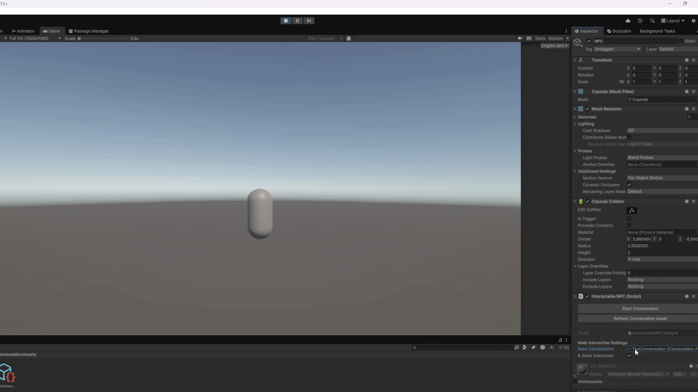

# NekoDialogue

> A modular, customizable dialogue system for Unity.

NekoDialogue provides a complete dialogue framework for Unity, designed around reusable components, customizable workflows, and easy integration into existing projects.

It provides everything needed to build dialogue systems ranging from simple conversations to more elaborate setups involving localization, typewriter effects, animated dialogue boxes, custom text processing, and NPC interactions.

## ⚠️ Getting Started — Samples Included

> New to Unity dialogue systems? Start here!

NekoDialogue includes a complete, ready-to-use example scene in the `Samples~` folder.

The sample includes a working implementation of the main systems provided by NekoDialogue, including:
- A DialogueManager
- An InputManager
- Test ConversationAssets
- Test dialogue themes
- A complete NPC interaction implementation
- Dialogue UI and box configuration
- Typewriter and audio blip effects
- Example dialogue processing and filters

The sample is designed specifically to provide a working starting point for beginners. You can import it, inspect how the different components work together, and use it as a reference when building your own dialogue system.

> NekoDialogue was designed with the same beginner experience in mind: the goal is not to give you a collection of disconnected systems and leave you to figure out how they should interact, but to provide a complete example of how everything can fit together.

## 🧩 Features
- Complete dialogue and conversation management
- Customizable dialogue UI, box layouts and styles
- Dialogue themes for consistent visual configuration
- Animated dialogue boxes
- Customizable typewriter effect
- Audio blip system for typewriter effects
- Support for both plain C# strings and Unity Localization
- Extensible dialogue text processing through custom filters
- Reusable interaction components
- Custom Editor tooling

---
Here is a demo of what this tool is capable of:

The gif below displays all possible anchor modes of the dialogue box (except for the `Speaker` anchor).

🛠️ Editor Tooling

  
NekoDialogue integrates practical Editor tooling designed to keep dialogue assets easy to create and manage! 
Here are pictures of two editor windows you will see a lot:

ConversationAsset editor:

DialogueLine editor window:

📚 Feature Details

  
## 💬 Conversations

Dialogue is organized through reusable ConversationAssets containing dialogue lines and their associated data.

Conversations can be started from any system capable of providing a ConversationAsset, allowing NekoDialogue to remain independent from a project's gameplay architecture.

The dialogue manager handles the lifecycle and progression of the active conversation while leaving input and interaction logic to the project using it.

This means that advancing a conversation can be connected to whatever input or gameplay system your project already uses.

For example, AdvanceConversation() can be called from:
- A custom input manager
- A Unity UI button
- A controller or keyboard action
- An interaction system
- A cutscene or scripted event
- An automatic dialogue system

**NekoDialogue does not require a specific input framework.**

## 🎨 Dialogue Themes & UI

Dialogue presentation is controlled through reusable themes and customizable dialogue box configurations.

Themes can define the visual presentation of conversations while dialogue boxes can be customized in terms of:

- Layout
- Animations
- Text presentation

This allows different conversations or characters to use different visual styles without requiring the dialogue system itself to be rewritten.

## 🌐 Localization & Plain Strings

NekoDialogue supports both localized dialogue and projects that do not require localization.

For smaller projects, dialogue can simply use regular strings.

For projects using Unity's Localization package, dialogue assets can instead use localized strings, allowing dialogue to participate in Unity's localization workflow.

This makes NekoDialogue suitable for both small projects that want a straightforward dialogue system and larger projects that require localization support.

> **Note:** Unity Localization support requires the Unity Localization package to be installed in your project.

## 🔧 Dialogue Text Filters

Dialogue text can be processed through a configurable filter pipeline.
NekoDialogue provides a DialogueProcessorSO which can contain as many DialogueTextFilterSOs as needed.

Each filter performs one specific transformation on the dialogue text, allowing features to be enabled or disabled independently.

For example, a project could use a DialogueProcessor with a Markdown Filter, a Color Tag Filter, a Sprite Icon Filter, an alien language tag filter...

Filters are intentionally modular. If a project does not need a particular feature, the corresponding filter simply does not need to be added.

Developers can also create their own custom filters by implementing the provided filter contract.

This makes it possible to add project-specific syntax without modifying NekoDialogue itself.

## ⌨️ Typewriter & Audio Blips

NekoDialogue includes a customizable typewriter effect for displaying dialogue progressively.

The typewriter system can be combined with an audio blip system, allowing characters to produce sounds as their dialogue is revealed.

This can be configured to fit different character voices, text styles, and presentation requirements.

## 📦 Installation

> NekoDialogue is distributed as a Unity package.

To install NekoDialogue:
1. Open the Unity Editor and go to `Window > Package Management > Package Manager`.
2. Click the "+" icon in the top-left corner. Select Install package from git URL.
3. Finally, enter: `https://github.com/im-shadee/NekoDialogue.git?path=/Package` and press "Install".

Once installed, NekoDialogue will be available in your project.

## Importing the Samples

The package includes a complete example implementation intended to help you get started quickly.

To import it:
1. Open `Window > Package Management > Package Manager`.
2. Select NekoDialogue.
3. Open the Samples tab.
4. Click Import.

The imported sample contains a complete working dialogue setup that can be used as a reference or starting point for your own project.

## 📄 License

NekoDialogue is released under the **MIT License**.

This applies to the entire package, including:

* Source code
* Shaders
* Editor tooling
* Dialogue assets
* Sample scenes
* Sample scripts
* Visual and audio assets included with the package

You are free to use, modify, distribute, and include NekoDialogue in both personal and commercial projects.

See `LICENSE` for the complete license text.

## 💭 Developer Note

NekoDialogue was created to provide the kind of dialogue system I would have wanted when I was first learning Unity.

Unity does not provide a complete built-in dialogue system, and building one from scratch can be surprisingly difficult when you are still learning how all of its different systems fit together.

The goal of NekoDialogue is therefore not only to provide the tools themselves, but also to provide a clear, working example that beginners can learn from while allowing experienced developers to adapt the system to their own projects.

NekoDialogue is part of a growing collection of reusable Unity tools designed to solve problems I have encountered throughout my own development workflow.

Thanks for using NekoDialogue!
